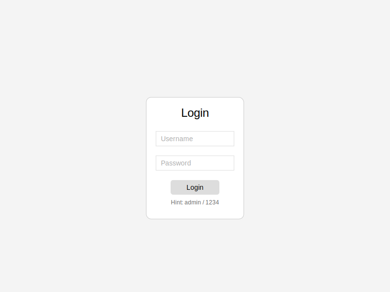
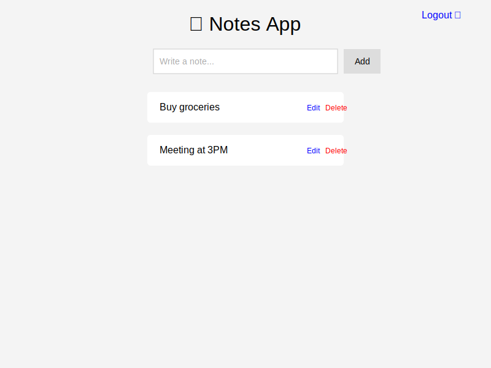
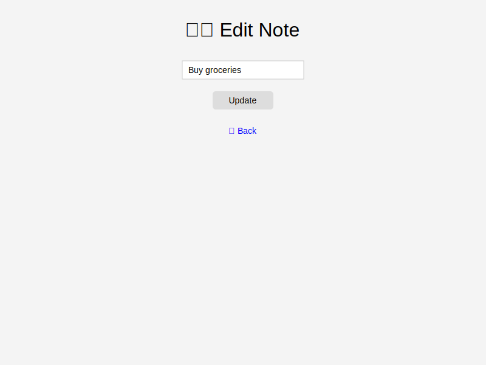

# Python Flask Sticky Notes App

A simple, secure, and persistent Sticky Notes application built with Python Flask and SQLite. This application allows users to create, read, update, and delete (CRUD) notes after logging in.

## Features

- **User Authentication**: Secure login and logout functionality.
- **Persistent Storage**: Notes and user credentials are stored in an SQLite database.
- **CRUD Operations**:
  - **Create**: Add new notes.
  - **Read**: View all your notes on the dashboard.
  - **Update**: Edit existing notes.
  - **Delete**: Remove notes you no longer need.
- **API Endpoint**: Includes a simple JSON API for adding two numbers (`/addNum`).
- **Responsive Design**: Simple and clean user interface.

## Screenshots

### Login Page


### Dashboard


### Edit Note


## Prerequisites

- Python 3.x installed on your system.

## Installation

1.  **Clone the Repository** (or download the source code):
    ```bash
    git clone <repository-url>
    cd python_flask_notes_app_with_basic_auth_database-main
    ```

2.  **Create a Virtual Environment** (Recommended):
    ```bash
    # Windows
    python -m venv venv
    venv\Scripts\activate

    # macOS/Linux
    python3 -m venv venv
    source venv/bin/activate
    ```

3.  **Install Dependencies**:
    ```bash
    pip install -r requirements.txt
    ```

## Running the Application

1.  **Start the Flask Server**:
    Since the application is defined in `app.py`, use the `flask` command to run it:
    ```bash
    flask run
    ```
    *Optional: To run in debug mode (auto-reload on changes):*
    ```bash
    flask run --debug
    ```

2.  **Access the Application**:
    Open your web browser and navigate to:
    [http://127.0.0.1:5000](http://127.0.0.1:5000)

## Usage

### Default Login Credentials
The application automatically creates a default admin user if one does not exist.

- **Username**: `admin`
- **Password**: `1234`

### Managing Notes
- **Login**: Use the admin credentials to access the dashboard.
- **Add Note**: Type your note in the input field and click "Add Note".
- **Edit Note**: Click the "Edit" link next to a note to modify it.
- **Delete Note**: Click the "Delete" link to remove a note.
- **Logout**: Click the "Logout" button to end your session.

### Adding More Users
You can create additional users by running the provided helper script `data.py` or by modifying it:
```bash
python data.py
```
*Note: This script adds a user named "vamsi" with password "1234".*

## Project Structure

- `app.py`: Main application file containing routes, database models, and logic.
- `requirements.txt`: List of Python dependencies.
- `templates/`: HTML templates for the application (Login, Index, Edit).
- `static/`: Static files (CSS, JS, Images).
- `instance/`: Directory where the SQLite database (`app.db`) is stored.
- `data.py`: Script to seed the database with an additional user.
- `sample.py`: A simple in-memory version of the app (for testing purposes).

## API Reference

### Add Numbers
- **URL**: `/addNum`
- **Method**: `POST`
- **Content-Type**: `application/json`
- **Body**:
  ```json
  {
    "num1": 10,
    "num2": 20
  }
  ```
- **Response**:
  ```json
  {
    "num1": 10,
    "num2": 20,
    "sum": 30
  }
  ```
